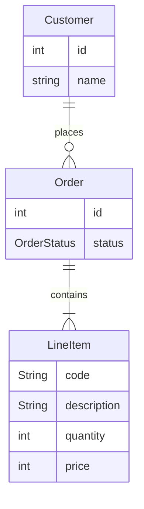

# Database Schema

```mermaid
erDiagram
    Customer {
        int id
        string name
    }
    Order {
        int id
        OrderStatus status
    }
    LineItem {
        String code
        String description
        int quantity
        int price
    }

    Customer ||--o{ Order : places
    Order ||--|{ LineItem : contains
```