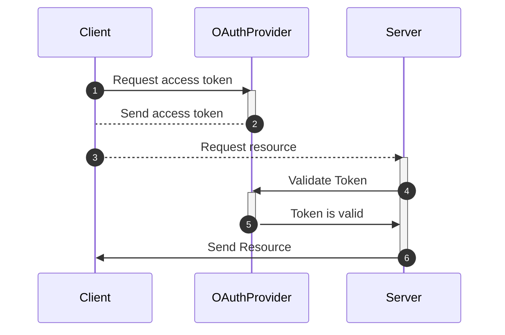

# Sequence Diagram

```mermaid
sequenceDiagram

autonumber

participant Client
participant OAuthProvider
participant Server

Client ->> OAuthProvider: Request access token
    activate OAuthProvider
OAuthProvider --> Client: Send access token
    deactivate OAuthProvider
Client -->> Server: Request resource
    activate Server
Server ->> OAuthProvider: Validate Token
    activate OAuthProvider
OAuthProvider ->> Server: Token is valid
    deactivate OAuthProvider
Server ->> Client: Send Resource
    deactivate Server
```