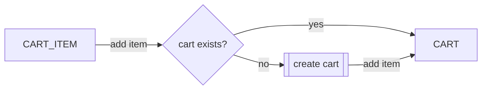
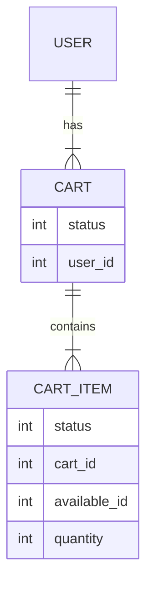
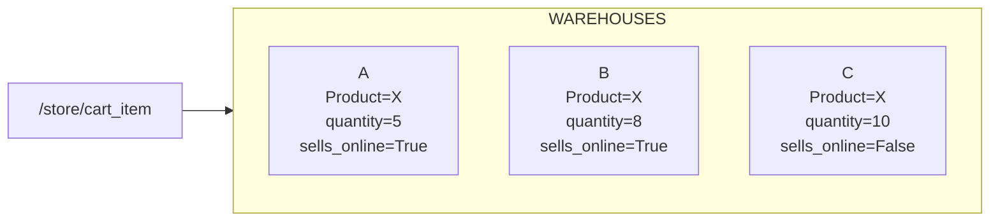

# Store
## Cart & Cart Items
### Creación de carrito de compras automáticamente
El carrito de compras se crea automáticamente al añadir algún artículo. Es decir, si no existe carrito de compras, se crea uno y se añade el artículo; si ya hay un carrito de compras, entonces se agrega el artículo al carrito.



#### Endpoint para añadir artículos
```
/store/cart_item
```

#### Payload para añadir artículos
```
{
    presentation: int,
    model: int,
    quantity: int
}
```

### Un solo carrito de compras activo por usuario
Sólo puede existir un carrito de compras activo por usuario. Esto se controla por medio de los estados en los que pueda estar un carrito. 
1. **DRAFT**
2. **RESERVED**
3. **COMPLETED**

*Nota. Los artículos del carrito comparten el mismo estado que el carrito de compras al que pertenecen.*



**DRAFT** es el estado en el que empiezan los carritos de compras. En este estado se pueden agregar y editar artículos. También es posible regresar a este estado si la orden de pago falla.

Cuando un carrito de compras pasa a **RESERVED**, todos los artículos se congelan y ya no es posible agregar más artículos. Esto pasa cuando se llama el endpoint* para crear la orden de pago.
*Revisar la sección Orden de pago

El carrito de compras pasa a **COMPLETED** cuando la orden de pago es pagada.

### Cómo funciona agregar artículos (explicación de available)
Al llamar el endpoint para agregar algún artículo, el payload requiere 3 valores: presentation, model, y quantity. 

El sistema filtra todos los availables que tengan la misma presentación y modelo, y que pertenezcan a almacenes que vendan en línea. La idea es que el cliente pueda agregar artículos al carrito de compras sin tener que revisar disponibilidad por almacén.

Por ejemplo, si hay dos almácenes que venden en línea (A y B). Donde ambos tienen un producto X.
- Almacén A tiene 5 productos X
- Almacén B tiene 8 productos X

*Nota. Producto X corresponde a dos Availables que comparten el mismo modelo y presentación, pero pertenecen a diferentes almacenes.*

En la tienda en línea, saldrán 13 productos X disponibles. El usuario puede seleccionar 10 y agregarlos a su carrito de compras. Lo que el sistema hará es que dentro de su carrito de compras, agregará los 8 productos del almacén B y 2 del almacén A.

Carrito de compras del cliente:
- Articulo 1: { Product: X, Warehouse B, Quantity: 8 }
- Artículo 2: { Product: X, Warehouse A, Quantity: 2 }



Revisión de Availables al momento de crear una orden de compra
La orden de compra se crea en estado borrador al sear creada
Una orden de compras se pasa a processing con PUT status=2
Antes de pasar a processing
	• Se revisa que Availables sigan disponibles
	• Que el usuario tenga dirección, correo y teléfono
Al momento de que una orden pasa a processing
Se crea la orden de pago CLIP