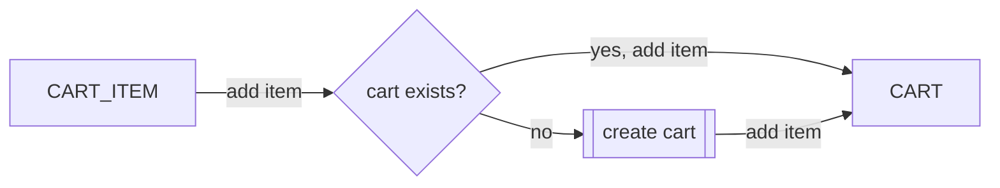
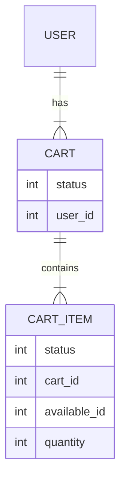
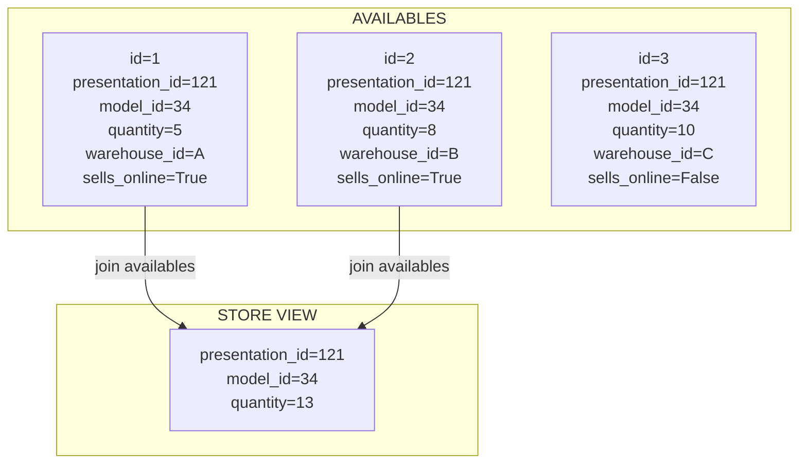
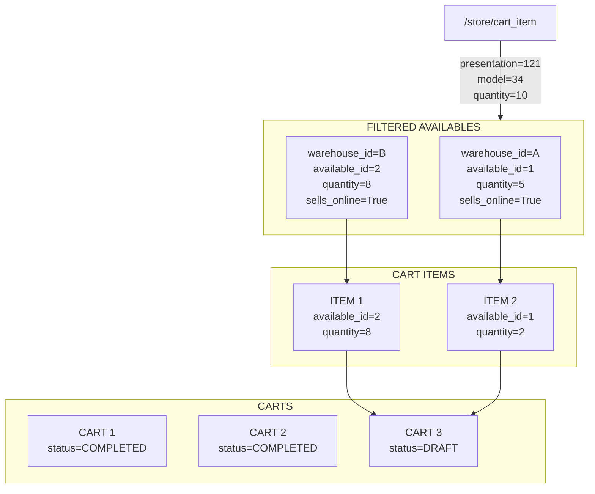

# Store
## Cart & Cart Items
### Creación de carrito de compras automáticamente
El carrito de compras se crea automáticamente al añadir algún artículo. Es decir, si no existe carrito de compras, se crea uno y se añade el artículo; si ya hay un carrito de compras, entonces se agrega el artículo al carrito.



#### Endpoint para añadir artículos
```
[POST]
/store/cart_item
```

#### Payload para añadir artículos
```
{
    presentation: int,
    model: int,
    quantity: int
}
```

### Un solo carrito de compras activo por usuario
Sólo puede existir un carrito de compras activo por usuario. Esto se controla por medio de los estados en los que pueda estar un carrito. 
1. **DRAFT**
2. **RESERVED**
3. **COMPLETED**

*Nota. Los artículos del carrito comparten el mismo estado que el carrito de compras al que pertenecen.*



**DRAFT** es el estado en el que empiezan los carritos de compras. En este estado se pueden agregar y editar artículos. También es posible regresar a este estado si la orden de pago falla.

Cuando un carrito de compras pasa a **RESERVED**, todos los artículos se congelan y ya no es posible agregar más artículos. Esto pasa cuando se llama el endpoint* para crear la orden de pago.

##### * Revisar la sección **Orden de Pago**
El carrito de compras pasa a **COMPLETED** cuando la orden de pago es pagada.

### Cómo funciona agregar artículos

El endpoint para agregar artículos requiere 3 valores en el payload: presentación, modelo y cantidad.

Al momento de recibir una petición, el sistema busca y agrupa todos los availables que tengan la misma presentación y modelo, y que pertenezcan a almacenes que vendan en línea; similar a la manera en la que el sistema le muestra al cliente el total de productos entre todos los almacenes, en lugar de mostrar productos repetidos. La idea es que el cliente pueda agregar artículos al carrito de compras sin tener que revisar disponibilidad por almacén.



Por ejemplo, supongamos que hay dos almácenes que venden en línea (A y B), donde ambos tienen un producto X con la misma presentación y modelo.
- Almacén A tiene 5 productos X
- Almacén B tiene 8 productos X

*Nota. Producto X corresponde a dos Availables que comparten el mismo modelo y presentación, pero pertenecen a diferentes almacenes.*

En la tienda en línea, se mostrarán en total 13 productos X disponibles. El usuario puede seleccionar 10 y agregarlos a su carrito de compras. El sistema agregará entonces 8 unidades del almacén B y 2 del almacén A en el carrito de compras del usuario.

Carrito de compras del cliente:
- Item 1: { Product: X, Warehouse B, Quantity: 8 }
- Item 2: { Product: X, Warehouse A, Quantity: 2 }


*Nota. En este ejemplo, la llamada al endpoint para agregar un artículo al carrito de compras resultó agregando dos artículos por falta de disponibilidad en un almacén.*

*Notas adicionales. Almacén C no aparece porque no vende en linea. Las órdenes de Cart 1 y 2 ya fueron completadas.*

## Pendiente...
- Crear Orden a partir de carrito de compras
- Actualizar Orden para crear orden de pago
    - Congelar artículos y carrito de compras
- API Webhook de CLIP